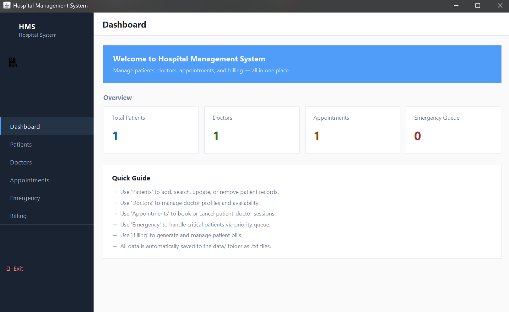
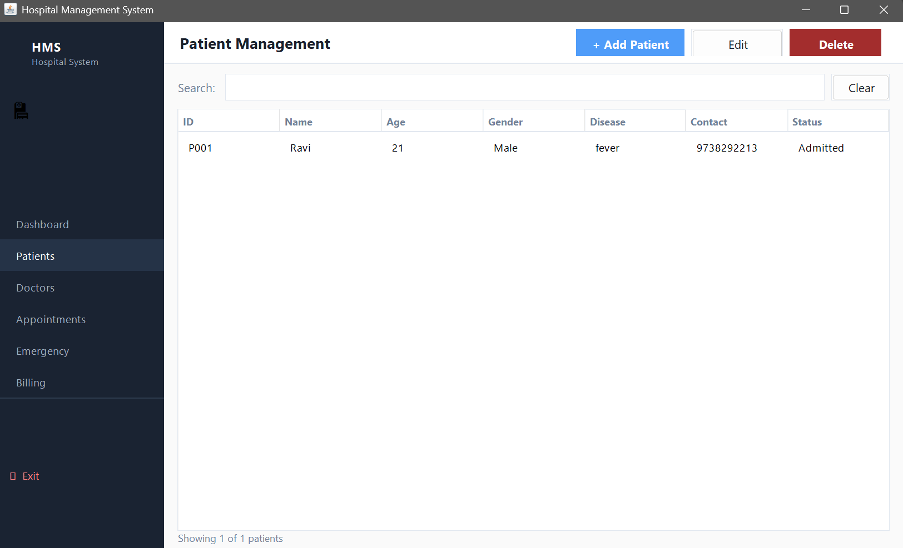
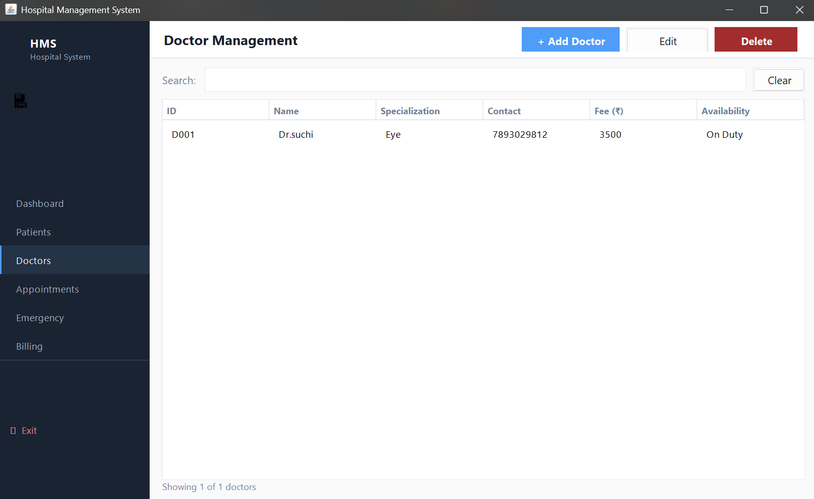
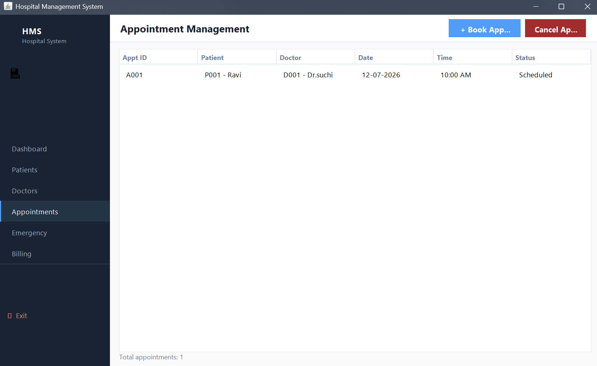
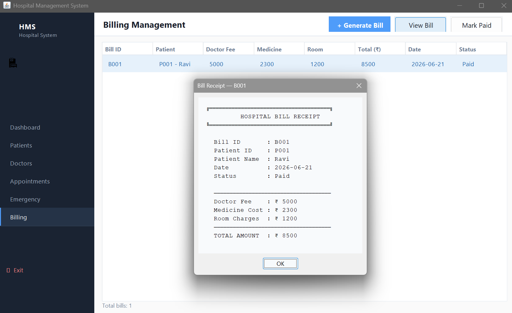

🏥 Hospital Management System

A desktop-based Hospital Management System developed in Java to streamline hospital operations. The system provides features for managing patients, doctors, appointments, billing, and medical records through a user-friendly graphical interface.

🔹 Features
• Patient Registration
• Doctor Management
• Appointment Scheduling
• Billing System
• Medical Records Management
• User-Friendly GUI

🛠 Technologies Used
• Java
• Swing/JavaFX
• MySQL (if used)
• JDBC

📚 Developed as an academic project for learning software development and database integration.

## Screenshots

### Dashboard

### Patient Management

### Doctor Management

### Appointment Management

### Billing Management

